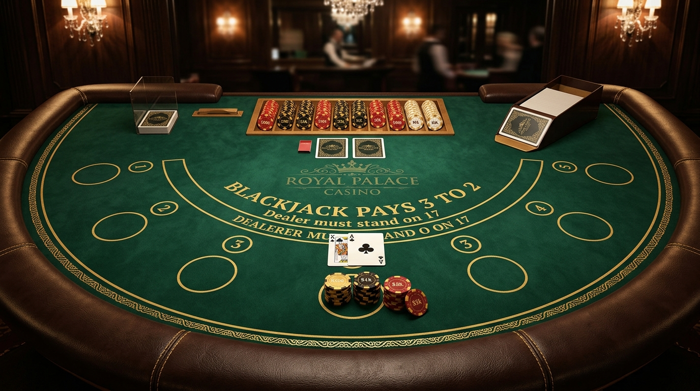

# 👑 Royal Palace VIP Blackjack — Multiplayer Casino

> **Game Kartu Blackjack Multiplayer Real-Time dengan Aturan Kasino Resmi Standar Global (Vegas Strip S17).**



---

## 🌟 Fitur Utama

- **Aturan Kasino Resmi (Global Casino Standard):**
  - **Shoe 6 Dek:** 312 kartu standar internasional dengan pengocokan *Fisher-Yates*, kartu potong (*cut card*) pada kedalaman ~75%, serta ritual pembakaran 1 kartu awal (*burn card*).
  - **Dealer Stands on 17 (S17):** Dealer wajib hit pada total 16 ke bawah dan wajib stand pada semua total 17 (termasuk Soft 17).
  - **Vegas Peek Rule:** Dealer memeriksa kartu tertutup (*hole card*) untuk Blackjack secara instan saat menunjukkan As atau kartu bernilai 10.
  - **Natural Blackjack 3:2:** Bayaran 150% keuntungan untuk As + 10 pada 2 kartu pertama.
  - **Double Down:** Dapat dilakukan pada 2 kartu pertama mana pun (menerima tepat 1 kartu lalu otomatis stand).
  - **Split Hand:** Memisahkan pasangan kartu bernilai sama hingga beberapa tangan. Split As hanya menerima 1 kartu (aturan resmi Vegas).
  - **Late Surrender:** Menyerahkan kartu awal sebelum aksi lain, mengembalikan 50% taruhan.
  - **Asuransi (2:1) & Even Money:** Pilihan asuransi jika dealer membuka As.

- **Multiplayer Fleksibel:**
  - **Online P2P Room (WebRTC via PeerJS):** Buat meja dengan kode unik 6-karakter atau bergabung ke meja teman secara real-time.
  - **Multi-Tab Sync (BroadcastChannel):** Buka beberapa tab di browser yang sama tanpa perlu koneksi internet luar.
  - **Local Multi-Seat / Pass & Play:** Duduk di kursi 1 s/d 5 di satu perangkat.
  - **AI Bots:** Opsi mengisi kursi kosong dengan bot cerdas (*Elena, Marcus, Sophia, Kenji*).
  - **Live Table Chat & Emoji:** Obrolan meja langsung dan reaksi instan.

- **Audio & Visual Premium:**
  - **Procedural Web Audio API:** Efek suara realistis tanpa dependensi berkas suara eksternal (kartu meluncur, keping chip berdentang, kemenangan, blackjack fanfare, dan bust).
  - **Hi-Lo Card Counting HUD:** Menampilkan *Running Count* dan *True Count* secara langsung.
  - **Saran Strategi Dasar (Basic Strategy Advisor):** Bagan rekomendasi langkah matematis terbaik.
  - **Dwibahasa:** Bahasa Indonesia & English (ID/EN).

---

## 🚀 Cara Menjalankan

### Cara 1: Menggunakan Script Peluncur (Windows)
Cukup klik ganda berkas:
```
start_server.bat
```
Atau jalankan via PowerShell:
```powershell
.\start_server.ps1
```
Lalu buka browser di: **http://localhost:8080/**

### Cara 2: Buka Langsung (Tanpa Server)
Buka berkas `index.html` langsung di browser favorit Anda (Chrome, Edge, Firefox, Brave).

---

## 📂 Struktur Berkas

```
├── assets/
│   ├── card_back.jpg          # Desain kartu belakang luxury gold
│   └── table_bg.jpg           # Background meja kasino felt hijau
├── js/
│   ├── audio.js               # Synthesizer audio procedural Web Audio API
│   ├── game.js                # Controller alur permainan dan giliran
│   ├── i18n.js                # Manajemen bahasa Indonesia & Inggris
│   ├── peer-multiplayer.js    # Sinkronisasi WebRTC P2P & Multi-tab
│   └── rules.js               # Mesin aturan resmi kasino & strategi dasar
├── index.html                 # Tampilan meja kasino responsif
├── style.css                  # Desain visual felt, kartu 3D, dan chip
├── start_server.bat           # Launcher batch 1-klik
├── start_server.ps1           # HTTP server lokal mandiri
└── README.md                  # Dokumentasi proyek
```

---

## 📜 Lisensi
MIT License. Bebas digunakan dan dimodifikasi untuk tujuan belajar dan rekreasi.
